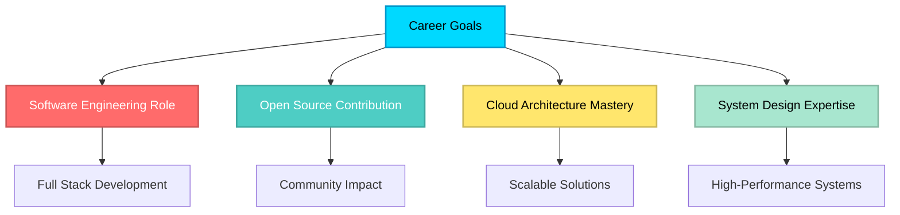

<div align="center">

# 👋 Hi there, I'm Ankit Kumar!

### 🚀 Full Stack Developer | Problem Solver | MERN Enthusiast


[](https://www.linkedin.com/in/ankit-kumar-aa585a231/)
[](https://leetcode.com/u/Ankit07kr/)
[](https://funny-cactus-d591c6.netlify.app/)
[](mailto:ankit07vision@gmail.com)

</div>

---

## 💼 About Me

I am a dedicated **Full Stack Developer** pursuing B.E. in Computer Science at Chandigarh University, with a strong foundation in the **MERN stack** and proven expertise in building production-ready applications. My experience spans developing complete end-to-end solutions, from architecting scalable backends to crafting intuitive user interfaces.

**What I Bring:**
- 🏗️ **End-to-End Development:** Proficient in designing, developing, and deploying full-stack applications with modern architectures
- 🧩 **Problem-Solving Excellence:** Solved 550+ LeetCode problems with strong command over Data Structures, Algorithms, and System Design
- ⚡ **Performance Optimization:** Hands-on experience with Redis caching, database indexing, and API optimization techniques
- 💳 **Payment Integration:** Successfully implemented Stripe payment systems in production environments
- 🔐 **Security-First Approach:** Expertise in implementing JWT authentication, role-based access control, and secure API development

**Technical Proficiency:**
- 🎯 Full-stack expertise in **React.js, Next.js, Node.js, and Express.js** for building modern web applications
- 🗄️ Proficient in **database design and optimization** for MongoDB, MySQL, and Redis
- 🔗 Specialized in building **RESTful APIs** with scalable and maintainable architecture
- 🎨 Strong command over **responsive UI/UX design** using Tailwind CSS, Bootstrap, and modern CSS frameworks
- 🐳 Experience with **Docker containerization** and deploying applications on cloud platforms
- 🔧 Skilled in **version control with Git** and collaborative development workflows

---

## 🛠️ Tech Stack

<div align="center">

### 👨‍💻 Languages


### ⚡ Frameworks & Libraries


### 🗄️ Databases


### 🔧 Tools & Platforms


</div>

---

## 🚀 Featured Projects

### 🚗 [Vehicle Listing & Booking Platform](https://campusrentals-m3im.vercel.app/)
> A comprehensive full-stack solution for vehicle rental management with enterprise-grade features

```
🔹 Tech Stack: Next.js | Node.js | Express.js | MongoDB | Redis | Stripe | JWT
```

**Key Implementations:**
- 🔐 Multi-tier authentication system with JWT and role-based access control (RBAC)
- 💳 Complete payment processing pipeline using Stripe API with webhook integration
- ⚡ Redis caching layer achieving 60% reduction in database queries
- 🛡️ RESTful API architecture with comprehensive error handling and validation
- 📊 Admin panel with real-time analytics and fleet management capabilities
- 🔄 Booking system with availability tracking and automated notifications

**🔗 [Live Demo](https://campusrentals-m3im.vercel.app/) | [Source Code](https://github.com/ankit07vision-stack/vehicle-booking)**

---

### 🎓 [Testify – EdTech Platform](https://testify-coral.vercel.app/)
> Scalable online assessment platform with automated evaluation and learning management

```
🔹 Tech Stack: React.js | Node.js | Express.js | MongoDB | Stripe | JWT
```

**Key Implementations:**
- 📝 Dynamic test generation engine with multiple question formats
- 👨‍💼 Feature-rich admin dashboard for content and user management
- 💰 Subscription management system with recurring payment support
- 📈 Advanced analytics for tracking student performance metrics
- 🎯 Secure test environment with anti-cheating measures
- ⏱️ Real-time test submission and automated grading system

**🔗 [Live Demo](https://testify-coral.vercel.app/) | [Source Code](https://github.com/ankit07vision-stack/testify)**

---

### 🖼️ [BG Remover](https://bg-remover-3t5s.vercel.app/)
> Efficient image processing application leveraging AI-powered background removal

```
🔹 Tech Stack: React.js | Node.js | Express.js | MongoDB | Remove.bg API
```

**Key Implementations:**
- 🖱️ Intuitive drag-and-drop interface with real-time preview
- ⚡ Optimized API integration for rapid image processing
- 💾 User history management with cloud storage integration
- 📱 Fully responsive design ensuring cross-device compatibility
- 🔄 Batch processing capability for handling multiple images
- 🎨 Image format conversion and quality optimization features

**🔗 [Live Demo](https://bg-remover-3t5s.vercel.app/) | [Source Code](https://github.com/ankit07vision-stack/bg-remover)**

---

## 📊 Coding Stats & Achievements

<div align="center">

### 🏆 Competitive Programming

[](https://leetcode.com/Ankit07kr/)

**Problem-Solving Proficiency:**
- ✅ **550+ Problems Solved** across multiple difficulty levels
- 💪 **Core Strengths:** Dynamic Programming, Graph Algorithms, Binary Search, Sliding Window, Backtracking
- 📈 Consistent problem-solving practice with focus on optimal solutions
- 🥇 Active participant in weekly contests
- 🎯 **Expertise Areas:**
  - **Data Structures:** Arrays, Linked Lists, Trees, Graphs, Hash Tables, Heaps
  - **Algorithms:** Sorting, Searching, Recursion, Greedy, Divide & Conquer
  - **Advanced Topics:** Bit Manipulation, Segment Trees, Trie, Disjoint Set Union

---

### 📈 GitHub Analytics

<p align="center">
  
  
</p>

<p align="center">
  
</p>

<p align="center">
  
</p>

</div>

---

## 🎯 Professional Objectives

<div align="center">



</div>

**Current Focus Areas:**
- 🔍 Actively pursuing **software engineering opportunities** where I can contribute to building impactful products
- 🌱 Advancing expertise in **distributed systems**, **microservices architecture**, and **cloud-native development**
- 📖 Strengthening knowledge in **system design patterns**, **scalability**, and **performance optimization**
- 🤝 Seeking opportunities to collaborate on **challenging technical projects** that solve real-world problems
- 🏗️ Building a portfolio of **production-grade applications** that demonstrate architectural best practices

---

## 📫 Professional Network

<div align="center">

**I'm open to discussing software engineering opportunities, technical collaborations, and innovative project ideas.**

<br/>

[](https://www.linkedin.com/in/ankit-kumar-aa585a231/)
[](https://funny-cactus-d591c6.netlify.app/)
[](mailto:ankit07vision@gmail.com)
[](https://github.com/ankit07vision-stack)

---

### 📧 ankit07vision@gmail.com

### 🌐 Available for Full-time & Internship Opportunities

---


</div>

---

<div align="center">


### ⚡ Activity Graph


---

**⭐ If you find my work valuable, consider starring the repositories!**

### 🤝 Let's build something amazing together!

</div>
